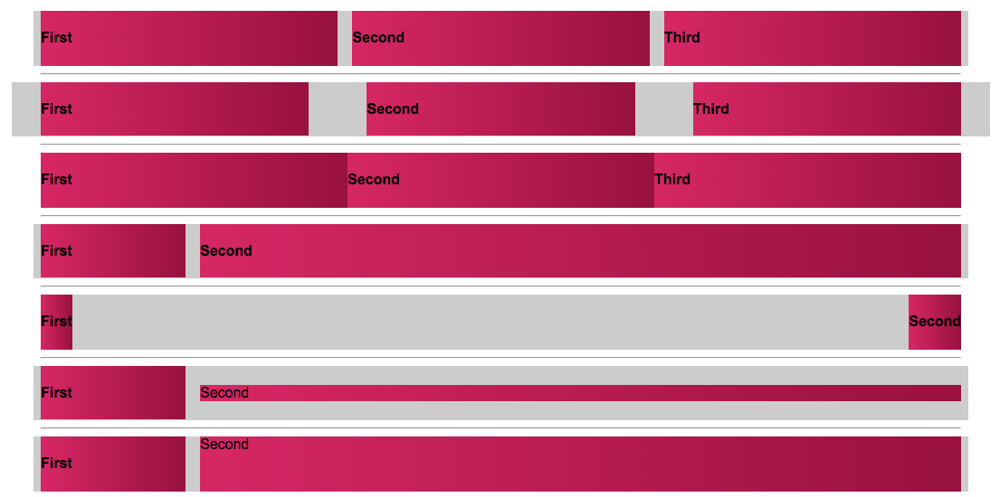
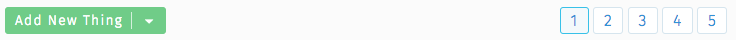

# React Flex Columns

React Flex Columns is an abstraction on CSS Flexbox-style columns for add-hoc layout that are not complex enough to justify writing custom CSS.

Inspired by https://philipwalton.github.io/solved-by-flexbox/demos/grids and https://css-tricks.com/dont-overthink-flexbox-grids

## Install

```sh
npm install react-flex-columns
```

## Basic Usage

```jsx
import { Columns, Column } from 'react-flex-columns'

const App = () => (
  <Columns>
    <Column flex>Left</Column>
    <Column flex>Right</Column>
  </Columns>
)
```

`<Columns>` creates a `div` with `display: flex`. The children `<Column>`'s must be the first level children of `<Columns>` and create `div`'s that are flex items. Flex items by default will be side-by-side with each other even though the divs are still block-level elements. As flex items, their width will be as wide as their contents unless other properties are provided like `flex: 1`. In the above example, providing a `flex` boolean property will create a `flex: 1` styling which in this case results in two 50% wide columns. [Learning more about Flexbox](https://css-tricks.com/snippets/css/a-guide-to-flexbox/) will help you use this module.


## Examples

[See the Codesandbox](https://codesandbox.io/s/q82o4m511j) for an interactive example



## Why

Chances are your App's main layout is sophisticated and requires custom styles. This module is not trying to replace that. Also, chances are you have "UI Components" that are re-usable throughout your application like buttons and pagination. Often times you'll need to arrange those components side-by-side with each other. Perhaps at the bottom of some search results you want a "Add New Thing" button on the left, and to its right you want some pagination.



Writing custom styling for these side-by-side situations each time you need them is too repetitive and difficult to organize since these styles are not coupled to the components themselves, and they're one-offs so they're not apart of your big-picture layout styles also. I call these "micro layouts". Personally, I tend to write styles for components, and for the big layout, but when it comes to organizing components within the layout (with a micro layout), I'd prefer to not write custom styles. I'd rather use an abstraction like this module to "compose" these micro layouts.

## Responsive Design

Either implement your own external responsive strategy and do `<Columns stack={youControlThisBoolean}>` when you want it to stack columns instead of organizing them side-by-side. Or pass `stackMaxWidth` prop (see below) and specify responsive rules you want the columns to adhere to -- (uses [react-media](https://github.com/ReactTraining/react-media) under the hood).

## API

There are two React components exported as named exports:

```sh
import { Columns, Column } from 'react-flex-columns'
```

### `<Columns>`

This will return a `div` with `display: flex`. Here are some props you can pass it for customization:

Property | Type | Description
----- | ----- | -----
**className** | *string* | A class you want added to the flex container. Note that it will already come with `react-flex-columns` as a class incase you want to hook in for custom styling.
**middle** | *boolean* | Sets `align-items: center` to adjust all flex items to be in the vertical middle. Defaults to `false`.
**gutterSize** | *number* | Creates a gutter with CSS `em` units in the number provided.
**gutters** | *number* | Short for `gutterSize={1}`
**split** | *boolean* | Instead of stacking columns from left to right, split the columns so the right one is aligned to the right of the flex container. This effectively does `justify-content: space-between`. Defaults to `false`.
**reverse** | *boolean* | Reverse the display ordering from what the DOM order. This effectively does `flex-direction: row-reverse`. Defaults to `false`.
**stack** | *boolean* | This effectively turns off "flexbox columns" and goes into a vertical stack-mode. Note that in this case, only the contents of `<Column>` is returned. The `div` tags that would ordinarily be there for flexbox columns will not be returned in stack-mode. Defaults to `false`.
**stackMaxWidth** | *string* or *number* | Sets Media Query rules (using [react-media](https://github.com/ReactTraining/react-media)) and forces `<Columns>` into stack-mode if `stackMaxWidth` is smaller than the value provided. Strings values should contain units ('30em' or '500px'), Number units will be in pixels.


### `<Column>`

This will return a `div` which is a flex-item. Here are some props you can pass it for customization:

Property | Type | Description
----- | ----- | -----
**className** | *string* | A class you want added to the flex container. Note that it will already come with `react-flex-column` as a class incase you want to hook in for custom styling.
**flex** | *boolean* | Use this when you want to set `flex: 1` styling. Defaults to `false`.
**size** | *number* | As an alternative to `flex`, this sets a specific width using `em` units. Don't use this with `flex` on the same `<Column>`
**align** | *['left', 'center', 'right']* | Sets `text-align` on the column. Not using this prop will set no `text-align` value which means the default is whatever your inherited styles are (probably left align).
